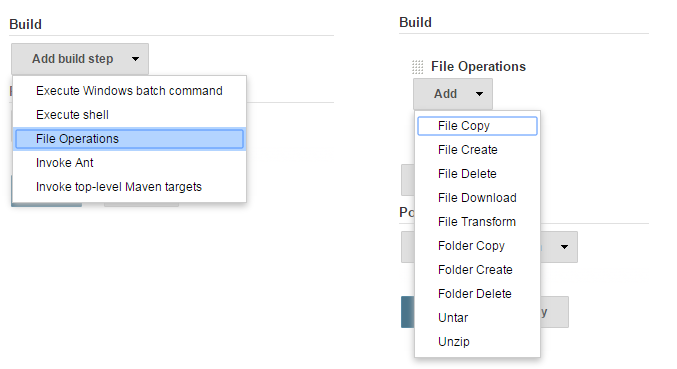

# File Operations Plugin

[](https://plugins.jenkins.io/file-operations)
[](https://ci.jenkins.io/job/Plugins/job/file-operations-plugin/job/main)
[](https://ci.jenkins.io/job/Plugins/job/file-operations-plugin/job/main)
[](https://github.com/jenkinsci/file-operations-plugin/blob/master/docs/CHANGELOG.md)
[](https://plugins.jenkins.io/file-operations)

This plugin's main goal is to provide **cross platform** file operations as Build step. 
It also provides the same functionality as [Pipeline](https://plugins.jenkins.io/workflow-aggregator/) step.

No need to search for *Nix or Win commands to do file operations.

## List of steps:

1. File **Copy** Operation
2. File **Delete** Operation
3. File **Create** Operation
4. File **Download** Operation
5. File **Transform** Operation
6. File **UnTar** Operation
7. File **UnZip** Operation
8. **Folder Create** Operation
9. **Folder Copy** Operation
10. **Folder Delete** Operation
11. File **Join**
12. File **Properties To Json**
13. File **Zip** Operation
14. **File Rename** Operation
15. **Folder Rename** Operation

For more details about each step please refer to: [File Operations Steps](https://www.jenkins.io/doc/pipeline/steps/file-operations/)

## Pipeline Usage Examples

This section provides examples of how to use the File Operations Plugin in Jenkins pipelines. These examples demonstrate the most common file operations, which you can easily incorporate into your own pipeline scripts.

To use these examples in your Jenkins pipeline, follow these steps:

1. **`SetUp Your Jenkins Environment`**: Ensure that Jenkins is set up and that the File Operations Plugin is installed.

2. **`Create or Edit a Jenkins Pipeline Job`**:
   - Go to your Jenkins instance.
   - Create a new pipeline job or edit an existing one.

3. **`Add the Pipeline Script`**: Copy and paste the relevant example script into the pipeline script area of your job configuration.

4. **`Run the Pipeline`**: Save the job configuration and run the pipeline to see the file operations in action.

### 1. File Copy Operation

This operation copies files from one location to another. It is useful for scenarios where you need to move or replicate files as part of your build process.

```groovy
pipeline {
    agent any
    stages {
        stage('Copy Files') {
            steps {
                fileOperations([
                    fileCopyOperation(sourceFiles: 'src/*.txt', targetLocation: 'dest/')
                ])
            }
        }
    }
} 
```

Explanation:
 **`sourceFiles`** :'src/*.txt': Specifies the files to copy from the source directory. In this case, all `.txt` files in the `src` directory.
**`targetLocation`**:'dest/': Defines the destination directory where the files will be copied to.

### 2. File Deletion Operation

This operation deletes files based on a specified pattern. It is useful for cleaning up old or unnecessary files during the build process.

```groovy
pipeline {
    agent any
    stages {
        stage('Delete Files') {
            steps {
                fileOperations([
                    fileDeleteOperation(includeFilePattern: '**/old-files/*.log')
                ])
            }
        }
    }
}
```
Explanation:
**`includeFilePattern`**: `'**/old-files/*.log'`: Specifies the pattern for files to delete. In this case, all `.log` files in any `old-files` directory.

### 3. File Create Operation

This operation creates a new file with specified content. It is useful for generating configuration files or other necessary files as part of the build process.
```groovy
pipeline {
    agent any
    stages {
        stage('Create File') {
            steps {
                fileOperations([
                    fileCreateOperation(filePath: 'newfile.txt', fileContent: 'Hello, World!')
                ])
            }
        }
    }
}
```
Explanation:

**`filePath`**:`'newfile.txt'`: Specifies the path for the new file.
**`fileContent`**: `'Hello, World!'`: Defines the content to be written to the new file.

### 4. File Download Operation
This operation downloads a file from a specified URL and saves it to a designated location. It is useful for retrieving external resources or dependencies needed for the build.

```groovy
pipeline {
    agent any
    stages {
        stage('Download File') {
            steps {
                fileOperations([
                    fileDownloadOperation(url: 'https://example.com/file.zip', targetLocation: 'downloads/')
                ])
            }
        }
    }
}
```
Explanation:

**`url`**: `'https://example.com/file.zip'`: The URL of the file to download.
**`targetLocation`**: `'downloads/'`: The directory where the downloaded file will be saved.


## Version History

See the [changelog](docs/CHANGELOG.md)

## Build step usage screenshot



## Job DSL

See the [Job DSL usage example](docs/JOB-DSL.md).